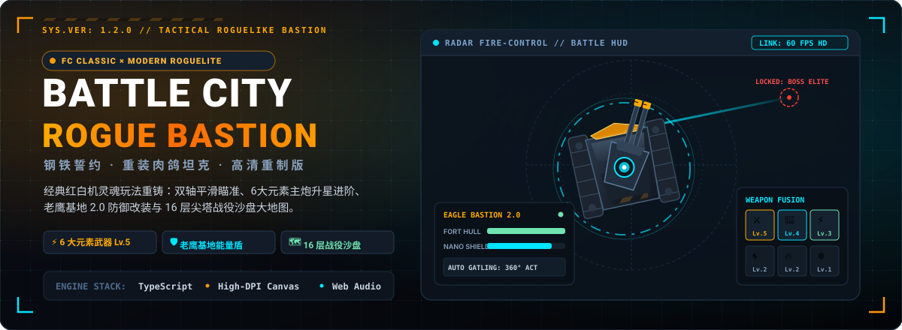

<p align="center">
  
</p>

<p align="center">
  <a href="https://holynova.github.io/battle-city-roguelike/"></a>
  <a href="https://github.com/holynova/battle-city-roguelike"></a>
  <a href="https://vitejs.dev/"></a>
  <a href="LICENSE"></a>
</p>

<p align="center">
  <strong>经典红白机（FC）《坦克大战》灵魂玩法 × 现代肉鸽构筑深度 × 视网膜级高精矢量着色管线</strong><br>
  双轴平滑瞄准 · 6 大元素主炮 Lv.1~5 升星 · 基地护盾与近防机炮 · 16 层尖塔战役沙盘 · 纯原生 Canvas & Web Audio
</p>

---

## 🕹️ 在线试玩与项目地址

- **线上试玩（即开即玩）**：[https://holynova.github.io/battle-city-roguelike/](https://holynova.github.io/battle-city-roguelike/)
- **GitHub 仓库**：[https://github.com/holynova/battle-city-roguelike](https://github.com/holynova/battle-city-roguelike)
- **技术亮点**：零臃肿重量级引擎，纯原生 **TypeScript + High-DPI Canvas 2D + Web Audio API** 打造，超轻量极速加载，适配桌面与移动端触控。

---

## 🌟 游戏核心机制

### 1. 视网膜级现代打击感 (HD / Retina Ready)
* **矢量高精渲染**：告别模糊的马赛克放大拉伸，每一颗铆钉、履带链节、装甲高光与跳弹反光均在 2K / 4K / Retina 屏幕上达到像素级锐利度。
* **独立双轴底盘与炮塔火控**：底盘拥有真实的差速动力学与履带转弯惯性，炮塔 360° 独立平滑瞄准（支持鼠标光标精确跟瞄与自动辅助火控）。
* **战场物理微细节**：
  * **履带压痕系统**：战车驶过泥泞、雪地留下持久的高清双轨压痕；
  * **真实跳弹（Ricochet）**：动能弹丸命中钛合金白钢墙或地图边界时发生高角度物理折射跳弹并附加增伤；
  * **动态弹坑与碎片**：击毁砖墙时生成多层物理砖渣破片、飞溅尘雾与冲击波扩散环。

### 2. 老鹰基地 2.0 (Eagle Bastion) 科技体系
告别红白机时代一发冷枪秒杀老鹰的挫败感，基地全面引入现代化防御工事：
* **独立能量护盾与装甲生命值**：老鹰要塞拥有常驻装甲血条，受到袭击优先消耗护盾；
* **360° 全自动近防速射机炮**：加装近防科技后，基地将自动锁定进入射程的入侵敌坦并实施密集扫射；
* **自充能纳米护盾矩阵**：要塞脱战后持续自我充能回盾；
* **工兵加固指令**：战地拾取铁锹或购买加固协议，瞬时将要塞外围浇筑为不可击破的钛合金白钢护壁。

### 3. 六大多维元素主炮（武器叠加升星 Lv.1 ~ Lv.5）
初始配备标准穿甲主炮，战胜敌军与通关后可从三选一战利品中解锁并强化全新元素武器：

| 武器系统 | 元素图标 | 核心战术机制 | 升星质变特性 (Max Lv.5) |
| :--- | :---: | :--- | :--- |
| **穿甲动能重炮** | ⚔️ | 高膛压穿甲弹，击穿砖墙，钢壁跳弹增伤 | Lv.2+ 开启双联火炮齐射，Lv.5 拥有毁灭性四连齐射 |
| **高能棱镜光束** | 💫 | 瞬发贯穿激光射线，穿透直线敌群 | 命中钢壁与首领时发生高频棱镜折射，形成交叉切割光网 |
| **球状闪电特斯拉**| ⚡ | 缓慢推进的等离子能量球 | 沿途释放多重连锁高压电弧并触发 EMP 强控瘫痪 |
| **烈风引力涡流** | 🌀 | 发射聚能微型黑洞奇点 | 强力吸扯周围敌方装甲聚拢，并吞噬偏折敌方炮火 |
| **凝固汽油迫击炮**| 🔥 | 高抛曲射破障迫击炮，无视掩体阻隔 | 着弹点化为大面积持续燃烧的焦土地带，强效破甲灼烧 |
| **急冻极寒霜爆** | ❄️ | 深冷低温碎冰弹 | 造成大范围 50% 减速与冰冻，受冻目标撞击受双倍重创 |

> **升星融合法则**：每次抽取同类主炮即可提升 1 个星级，每级带来 **+35% 单发伤害** 与 **-16% 装填冷却** 收益。

### 4. 20+ 款质变战术芯片 (Tactical Chips)
* **机动改装**：`全地形气垫水陆悬浮底盘`（水面畅行、冰面防滑）、`涡轮增压发动机`（移速 +25%，冲刺 CD -20%）、`重装破障撞角`（直接撞碎砖墙并造成 80 点冲撞伤）。
* **生存与护甲**：`加厚复合装甲`（生命上限 +40）、`纳米修复工程虫`（被动持续回血）、`战地纳米吞噬核心`（击杀即刻吸血修复 12 点）。
* **火控增强**：`双路自动装弹机`（主炮冷却 -28%）、`双联并行火炮`（多重弹道覆盖）、`高膛压穿甲弹`（弹速与直伤大幅提升）。

### 5. 尖塔式 16 层战役沙盘 (16-Floor Spire Campaign)
包含莱茵水堑、巷战迷宫、热带密林、极地冰原与钛金要塞等十余种战略地貌：
* ⚔️ **常规交火**：迎战侦察轻坦、突击双联、重装猛犸与导弹发射车集群；
* 💀 **三大精英指挥官首领战（独立血条与弹幕机制）**：
  * **第 4 层 · 烈焰掠食者「伊格尼斯」**：三向爆炎散射 + 投掷跳雷阵地 + 狂暴加速冲撞；
  * **第 8 层 · 雷暴泰坦「特斯拉」**：8 向环形等离子风暴 + 狙击电磁轨道炮 + 全屏 EMP；
  * **第 12 层 · 虚空使徒「引力巨擘」**：繁星螺旋弹幕 + 范围黑洞牵引引力弹；
* 👑 **第 16 层终局决战 · 陆上巡洋舰「歌利亚」（Goliath MK-IV）**：
  * **Phase 1**：203mm 破障 AP 重炮 + 双联巡航导弹集群连射；
  * **Phase 2**：360° 旋转弹幕地狱风暴（Danmaku Spiral Hell） + 移速超频；
  * **Phase 3**：全屏扫射灭绝死光 + 密集螺旋弹幕覆盖；
* 🛒 **战地黑市**：零件换取战备芯片、要塞大修与装甲强化；
* ⛺ **地下掩蔽营火**：选择【抢修休整】恢复 70% 状态，或【车床锻造】升级主炮星级；
* ❓ **战地突发事件**：高收益与高风险并存的机密抉择。

---

## 🕹️ 键位与战斗操控指南

| 操作指令 | PC 键鼠控制 | 移动端 / 辅助控制 | 战术功能描述 |
| :--- | :--- | :--- | :--- |
| **底盘机动** | **W / A / S / D** 或 **方向键** | 屏幕虚拟摇杆拖拽 | 360° 真实惯性动力学差速移动 |
| **炮塔火控瞄准** | **鼠标光标移动** | 触屏拖拽瞄准 | 炮塔独立于底盘朝向自由旋转瞄准 |
| **主炮开火** | **鼠标左键** 或 **空格键 (Space)** | 屏幕触控点击 | 发射当前装备主炮 |
| **战术喷射冲刺** | **空格键 (Space)** 或 **Shift** | 冲刺按钮快捷点按 | 瞬间喷射位移 + 拥有短暂无敌闪避帧（CD 1.5s） |
| **切换武器系统** | **数字键 1 ~ 6** 或 **鼠标滚轮** | 底部武器栏点击切换 | 实时切换已在战利品中解锁的 6 大元素主炮 |
| **自动瞄准 / 辅助火控** | **屏幕上方「自动开火」开关** | 顶部快捷按钮 | 开启后战车自动追踪瞄准并倾泻火力，单手即可作战 |
| **音效与战地配乐** | **屏幕右上角静音开关** | 快捷静音点按 | 控制程序化自适应合成器音效与战役背景音乐 |

---

## 📂 项目结构

```text
battle-city-roguelike/
├── assets/
│   └── readme/
│       └── hero.svg           # 项目原生纯矢量 1200x440 战术 HUD 题图
├── public/                    # 静态资产与图标
├── src/
│   ├── audio/                 # Web Audio API 动态合成音效与自适应战斗音乐
│   │   ├── MusicEngine.ts
│   │   └── SoundEffects.ts
│   ├── core/                  # 主物理引擎循环、碰撞矩阵与游戏状态
│   │   └── Engine.ts
│   ├── entities/              # 实体系统（玩家战车、敌群、首领、子弹、老鹰基地）
│   │   ├── BossTank.ts
│   │   ├── EagleBase.ts
│   │   ├── EnemyTank.ts
│   │   ├── PlayerTank.ts
│   │   └── Projectile.ts
│   ├── graphics/              # 视网膜矢量着色管线、粒子特效与战术图章
│   │   ├── HDGraphics.ts
│   │   ├── ParticleFX.ts
│   │   └── TacticalIcons.ts
│   ├── map/                   # 地形瓦片图层（砖墙、钢壁、冰面、河流与丛林）
│   │   └── TileMap.ts
│   ├── roguelite/             # 肉鸽要素（战役沙盘节点、三选一卡牌、芯片构筑）
│   │   ├── CampaignMap.ts
│   │   ├── Inventory.ts
│   │   └── Upgrades.ts
│   ├── ui/                    # 高清 HUD 仪表盘、Boss血条与三选一卡牌浮层
│   │   ├── HUD.ts
│   │   └── UIOverlay.ts
│   └── main.ts                # 程序启动入口与生命周期管理
├── index.html                 # 游戏主入口与 Canvas 挂载
├── package.json               # 项目依赖与编译脚本
├── tsconfig.json              # TypeScript 编译配置
└── vite.config.ts             # Vite 构建与部署配置
```

---

## 🛠️ 本地开发与快速上手

本项目基于 **Vite + TypeScript** 构建，零臃肿第三方框架，冷启动秒开：

```bash
# 1. 克隆代码仓库
git clone https://github.com/holynova/battle-city-roguelike.git
cd battle-city-roguelike

# 2. 安装项目依赖
npm install

# 3. 启动本地开发服务器（默认端口 5173）
npm run dev

# 4. 执行 TypeScript 严格类型检查并构建生产包
npm run build

# 5. 本地预览生产环境打包结果
npm run preview
```

---

## 📜 开源协议

本项目采用 [MIT License](LICENSE) 开源。欢迎提 Issue、发起 Pull Request 或为项目点亮 Star ⭐️！
