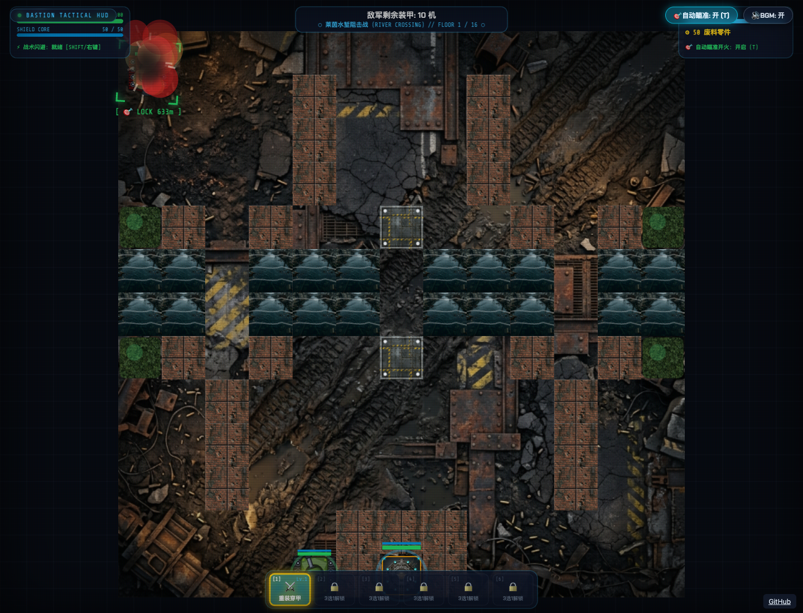

# Rogue Bastion · 坦克要塞

驾驶坦克守卫老鹰基地，在战役中切换元素主炮并选择强化。

A browser tank roguelite combining base defense, elemental weapons and campaign upgrades.

[在线体验](https://battle-city-roguelike.xiaosang.cc/) · [源码](https://github.com/holynova/battle-city-roguelike)



## 可以做什么

- 独立控制底盘移动与炮塔瞄准。
- 保护基地，选择战利品与战术芯片。

## 怎么玩

WASD / 方向键驾驶，鼠标瞄准，鼠标左键开火；Shift冲刺，数字键或滚轮切换已解锁武器。

## 本地运行

```bash
npm ci
npm run dev
# 生成生产产物
npm run build
```

许可证见 [LICENSE](LICENSE)。


## 发布

```bash
npm run build
npx --yes wrangler@4.128.0 deploy --config wrangler.jsonc
```

从 `main` 同一提交在本地手动发布到Cloudflare Workers。正式地址：[https://battle-city-roguelike.xiaosang.cc/](https://battle-city-roguelike.xiaosang.cc/)。
